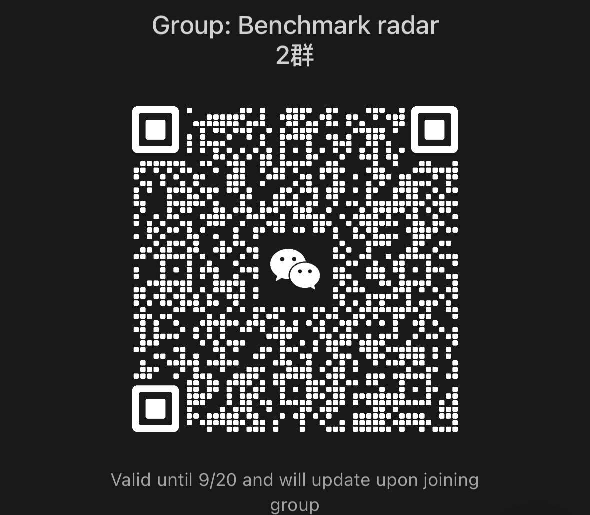

<div align="left">

[中文](README.zh-CN.md)

</div>

# Benchmark Radar

<!-- The record-count badge is data-driven: it is regenerated from the corpus on
every collection, so it states what the project actually holds rather than a
hand-edited number (issue #197). -->

<p align="center">
  <a href="https://koutian.is-a.dev/benchmark-radar/"></a>
  <a href="https://koutian.is-a.dev/benchmark-radar/data/radar.json"></a>
  <a href="https://x.com/ktwu01"></a>
  <a href="https://www.linkedin.com/in/ktwu01"></a>
  <a href="https://scholar.google.com/citations?user=s9w1k-cAAAAJ&amp;hl=en"></a>
</p>

I kept running into new benchmarks while doing benchmark research, so I built a
crawler that continuously collects benchmark-related signals from across the
web. It pulls evidence from arXiv, GitHub, Hugging Face, OpenAlex, OpenReview,
first-party lab feeds, Brave Search, Semantic Scholar, Hacker News, and more
every day, and keeps updating.

**Click the image to watch how reported AIME 2025 scores saturated over time.**

<a href="https://koutian.is-a.dev/benchmark-radar/?view=leaderboard&lfrontier=llm-stats-aime-2025">
  
</a>

## Use it

- **[Open the dashboard](https://koutian.is-a.dev/benchmark-radar/)** — today's insights, trends, popular benchmarks, model-card adoption, and more
- **[Subscribe via RSS](https://koutian.is-a.dev/benchmark-radar/feed.xml)** — get new benchmark signals every day
- **[Download the complete dataset](https://koutian.is-a.dev/benchmark-radar/data/radar.json)** — free, public, machine-readable JSON; no crawler or contact required
- **[Contribute](CONTRIBUTING.md)** — add benchmarks, model cards, sources, or fixes

If Benchmark Radar saves you research time, **[star the repository](https://github.com/ktwu01/benchmark-radar)**. It helps other eval builders find it.

## More

- **Scoring rubric:** [`src/benchmark_radar/rubric.py`](src/benchmark_radar/rubric.py)
- **Model-card adoption data:** [`data/model_cards.yml`](data/model_cards.yml)
- **Public corpus schema:** [`docs/cumulative-corpus.schema.json`](docs/cumulative-corpus.schema.json)
- **Citation metadata:** [`CITATION.cff`](CITATION.cff)
- **Configuration:** [`config.yml`](config.yml)
- **Run locally:** `python -m pip install -e '.[dev]' && benchmark-radar`
- **Support / bugs:** [open an issue](https://github.com/ktwu01/benchmark-radar/issues)
- **Contact:** [@ktwu01](https://github.com/ktwu01)
- **License:** MIT

## Join the WeChat group

Scan the QR code to join the WeChat group for daily benchmark updates and eval discussions:



## Acknowledgements

The frontier-model score layer (including the AIME 2025 chart above) is built on
benchmark data collected by [LLM Stats](https://llm-stats.com). Thank you for
keeping that data open.

## Citation

If Benchmark Radar supports your research or evaluation work, please cite it:

```bibtex
@misc{wu2026benchmarkradar,
  title        = {Benchmark Radar: A Daily, Evidence-First Radar and Machine-Readable Corpus for AI Benchmarks},
  author       = {Wu, Koutian},
  year         = {2026},
  howpublished = {\url{https://github.com/ktwu01/benchmark-radar}},
  note         = {Daily benchmark radar and open dataset}
}
```

See [`CITATION.cff`](CITATION.cff) for machine-readable citation metadata.

## Star History

<a href="https://www.star-history.com/#ktwu01/benchmark-radar&Date">
  <picture>
    <source media="(prefers-color-scheme: dark)" srcset="https://raw.githubusercontent.com/ktwu01/benchmark-radar/star-history/assets/star-history-dark.svg" />
    
  </picture>
</a>
